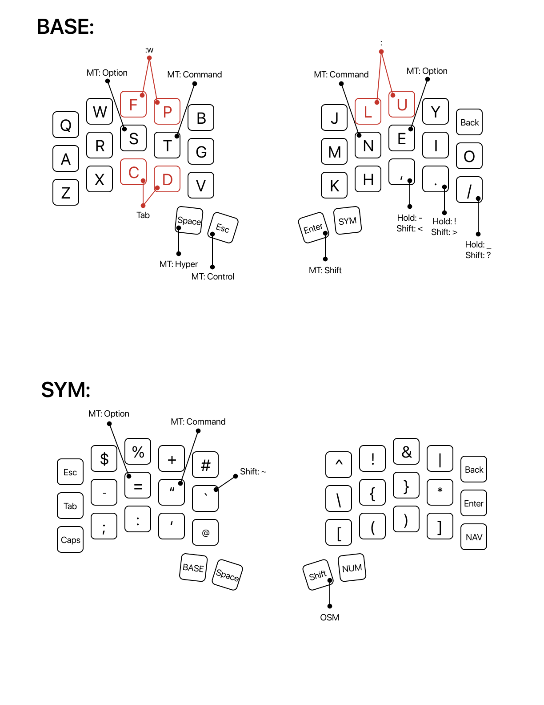
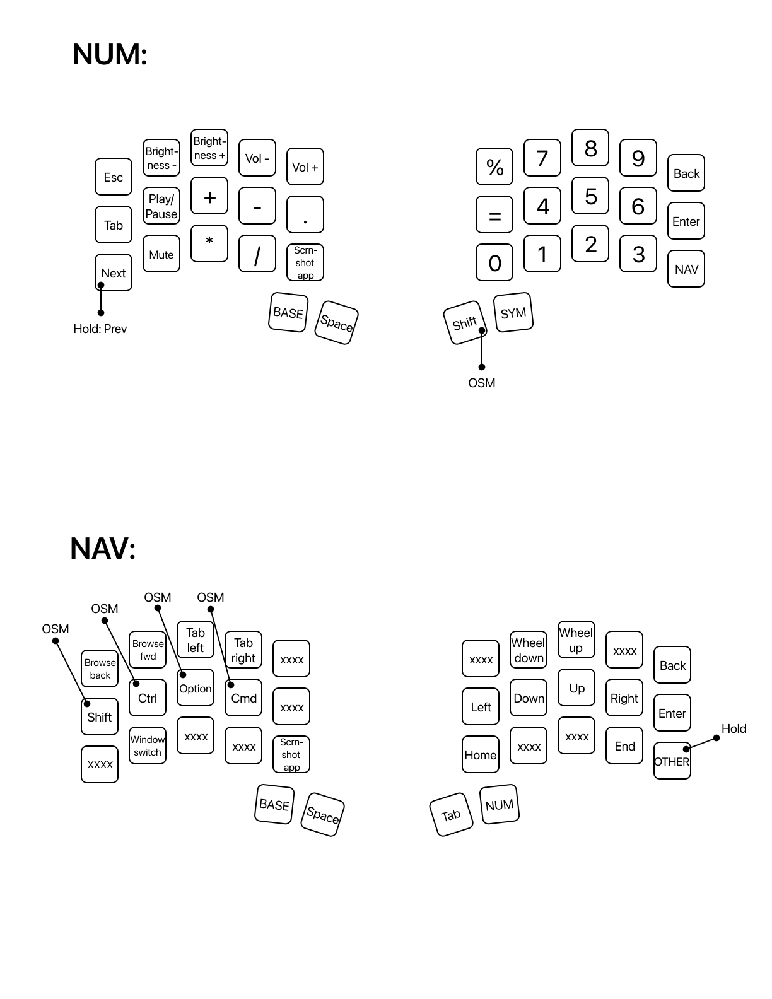
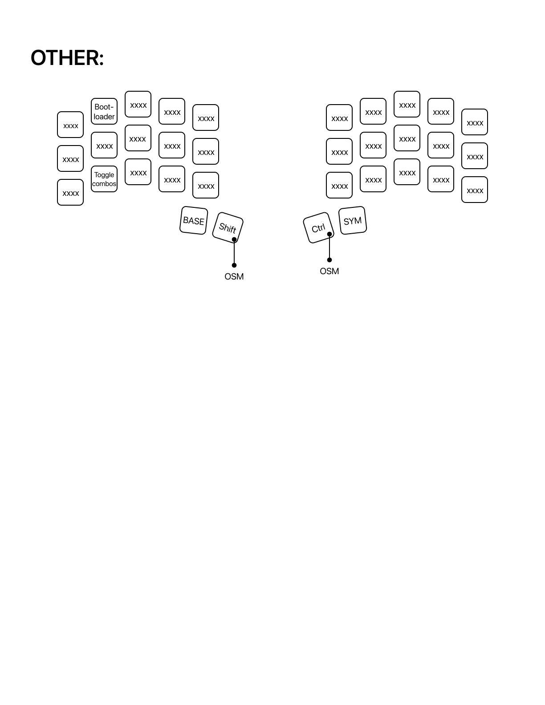

# Ryan's Custom Ferris Keymap

This is a custom Colemak DH keymap optimized for macOS usage and programming workflows.

This keymap features:

-   **Colemak DH base layout** for improved finger movement and comfort
-   **5 focused layers** with clear purposes (Base, Symbols, Numbers, Navigation, Other)
-   **Tap dance keys** for efficient punctuation input
-   **Layer toggles** instead of holds for sustained layer access
-   **macOS-optimized shortcuts** and media controls
-   **Key combos** for frequent actions like vim save commands
-   **Mod-tap keys** for space-efficient modifier access

The layout prioritizes programming efficiency and macOS integration while maintaining comfortable typing on just 34 keys.

## Visual Layout Overview







## What do all these layers do?

# Layer Overview

### Layer 0: Base Layer (Colemak DH)

```
Q  W  F  P  B     J  L  U  Y  BSPC
A  R  S  T  G     M  N  E  I  O
Z  X  C  D  V     K  H  ,  .  /
   HYPR ESC       ENT SYM
```

The base layer uses **Colemak DH** for improved typing comfort and efficiency. Key features:

**Mod-tap keys:**

-   `S` (Alt when held)
-   `T` (Cmd/GUI when held)
-   `N` (Cmd/GUI when held)
-   `E` (Alt when held)

**Thumb keys:**

-   Left inner: `Space` (Hyper when held)
-   Left outer: `Escape` (Ctrl when held)
-   Right inner: `Enter` (Shift when held)
-   Right outer: Toggle to Symbol layer

**Tap dance keys** (bottom row right):

-   `,` key: Tap for comma, hold for minus, double/triple tap for multiple commas
-   `.` key: Tap for period, hold for exclamation, double/triple tap for multiple periods
-   `/` key: Tap for slash, hold for underscore, double/triple tap for multiple slashes

### Layer 1: Symbols (SYM)

```
ESC $  %  +  #     ^  !  &  |  BSPC
TAB -  =  "  `     \  {  }  *  ENT
CAP ;  :  '  @     [  (  )  ]  NAV
    BASE SPC       SFT NUM
```

Comprehensive symbol layer optimized for programming. Brackets and braces are positioned for easy access, with the most common ones (`{}`, `()`) on the home row.

**Navigation:**

-   Toggle to BASE layer (left thumb inner)
-   Toggle to NUM layer (right thumb outer)
-   Toggle to NAV layer (right thumb bottom row)

### Layer 2: Numbers (NUM)

```
ESC BRD+ BRI+ VOL- VOL+    %  7  8  9  BSPC
TAB PLAY +   -    .        =  4  5  6  ENT
P/N MUTE *   /    SHOT     0  1  2  3  NAV
    BASE SPC              SFT SYM
```

Number layer with integrated media controls and mathematical operators:

**Left side - Media & System:**

-   Top row: Brightness and volume controls
-   Home row: Media playback, mathematical operators
-   Bottom row: Previous/Next track (tap dance), mute, screenshot app

**Right side - Numbers:**

-   Numbers 0-9 in a logical numpad-style layout
-   0 positioned at bottom left for thumb access
-   Common operators (%, =) for calculations

**Tap dance:**

-   Bottom left key: Tap for next track, double tap for previous track

### Layer 3: Navigation (NAV)

```
BACK FWD  TABL TABR ___     ___  WH_D WH_U ___  BSPC
OSFT OCTL OALT OGUI ___     LEFT DOWN UP   RGHT ENT
___  WSWT ___  ___  SHOT    HOME ___  ___  END  OTHR
     BASE SPC              TAB  NUM
```

Navigation layer optimized for both web browsing and system navigation:

**Left side - Browser & Modifiers:**

-   Top row: Browser back/forward, tab switching (Ctrl+Tab, Ctrl+Shift+Tab)
-   Home row: One-shot modifiers (Shift, Ctrl, Alt, GUI) for easy combinations
-   Bottom row: Window switching (Cmd+`), screenshot app

**Right side - Cursor & Scrolling:**

-   Arrow keys on home row for comfortable navigation
-   Mouse wheel controls
-   Home/End keys for line navigation

**Navigation:**

-   Toggle to OTHER layer (bottom right corner)
-   Toggle to NUM layer (right thumb)

### Layer 4: Other (OTHR)

```
___  BOOT ___  ___  ___     ___  ___  ___  ___  ___
___  ___  ___  ___  ___     ___  ___  ___  ___  ___
___  CMBO ___  ___  ___     ___  ___  ___  ___  ___
     BASE OSFT             ORCT SYM
```

System and configuration layer:

**Key functions:**

-   `BOOT`: Enter bootloader mode for firmware updates
-   `CMBO`: Toggle combo mode on/off
-   Various one-shot modifiers for system shortcuts

This layer is only accessible from the NAV layer and provides system-level functions.
Special Features
================

### Tap Dance Keys

This keymap includes several tap dance implementations:

1. **Period/Exclamation (.)**:

    - Single tap: `.`
    - Hold: `!`

2. **Comma/Minus (,)**:

    - Single tap: `,`
    - Hold: `-`

3. **Slash/Underscore (/)**:

    - Single tap: `/`
    - Hold: `_`

4. **Media Controls (Previous/Next)**:
    - Single tap: Next track
    - Double tap: Previous track

### Key Combos

Three useful combos are implemented:

1. **L + U**: Types `:` (colon) - useful for vim commands
2. **F + P**: Executes vim save (`:w⏎`) - quick save in vim
3. **C + D**: Types `Tab` - alternative tab access

### macOS Integration

The keymap includes several macOS-specific shortcuts:

-   **SC_SHOT**: `Cmd+Shift+4` (area screenshot)
-   **SC_SHOT_APP**: `Cmd+Shift+5` (screenshot app)
-   **WINDOW_SWITCH**: `Cmd+`` (switch between windows of same app)
-   **TAB_R/TAB_L**: `Ctrl+Tab` / `Ctrl+Shift+Tab` (browser tab switching)
-   **BR_BACK/BR_FWD**: `Cmd+Left` / `Cmd+Right` (browser navigation)

### Timing Configuration

The keymap uses custom timing settings optimized for comfort:

-   **Tapping term**: 240ms (defined in `config.h`)
-   **Retro tapping**: Enabled for better mod-tap behavior
-   **Combo term**: 50ms for quick combo recognition
-   **Combo count**: 3 combos total

### Building and Flashing

To compile this keymap:

```bash
# From your QMK root directory
qmk compile -kb ferris/0_1 -km rpallas1
```

To flash the keyboard:

```bash
# Put keyboard in bootloader mode first, then:
qmk flash -kb ferris/sweep -km rpallas1 -e CONVERT_TO=promicro_rp2040
```

### Customization

This keymap is designed around a specific workflow but can be easily modified:

1. **Layer adjustments**: Modify the layer arrays in `keymap.c`
2. **Timing tweaks**: Adjust values in `config.h`
3. **Combo changes**: Update the combo definitions and arrays
4. **macOS vs other OS**: Replace macOS shortcuts with OS-appropriate equivalents

The keymap prioritizes programming efficiency, vim usage, and macOS integration while maintaining the comfort benefits of the Colemak DH layout on a compact 34-key board.
